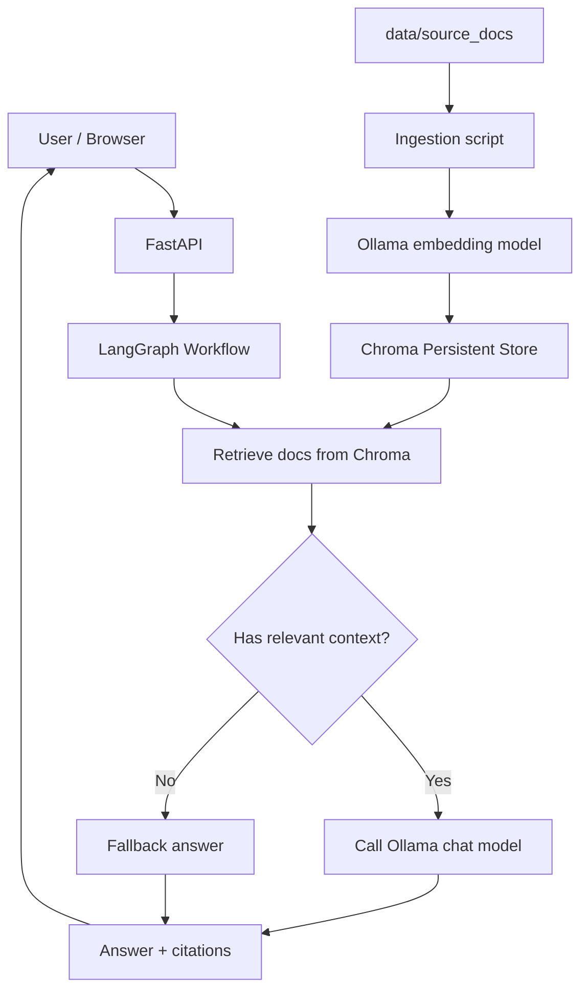

# enterprise-rag-assistant

日本語ドキュメントを検索し、**根拠付きで回答する RAG チャットボット**のポートフォリオ用サンプルです。  
`FastAPI + LangGraph + Chroma + Ollama` を使い、**無料に近い構成でローカル実行**できるようにしています。

## これが解く課題

想定ユースケースは、社内FAQ・運用ルール・申請手順・プロダクト仕様書などを横断検索して、
「どのドキュメントのどこを根拠に回答したか」を示しながら返答することです。

このリポジトリで見せたいのは次の 5 点です。

1. LLM アプリを**業務要件**として整理できること
2. Retrieval と生成を**分離して設計**できること
3. 回答不能時のフォールバックを用意し、**過剰な hallucination を抑える**こと
4. 評価データを置いて、**再現可能な改善サイクル**を回せること
5. API・テスト・CI・README を整えて、**本番運用に近い形**で見せられること

---

## システム構成



## ワークフロー方針

このサンプルは「自律的に動く agent」よりも、**決められた順序で安定して動く workflow** を優先しています。

- `retrieve`: 質問に対して関連チャンクを取得
- `judge`: コンテキストが十分かを判定
- `answer_with_context`: 根拠に基づいて回答
- `answer_without_context`: 根拠不足のため保守的に回答

そのため、**PoC から本番初期に乗せやすい構成**になっています。

---

## リポジトリ構成

```text
.
├── .env.example
├── .github/
│   └── workflows/
│       └── ci.yml
├── .gitignore
├── Dockerfile
├── Makefile
├── README.md
├── app/
│   ├── __init__.py
│   ├── config.py
│   ├── main.py
│   ├── schemas.py
│   ├── api/
│   │   ├── __init__.py
│   │   └── routes.py
│   ├── graph/
│   │   ├── __init__.py
│   │   ├── state.py
│   │   └── workflow.py
│   ├── llm/
│   │   └── ollama_client.py
│   ├── retrieval/
│   │   ├── __init__.py
│   │   ├── chroma_store.py
│   │   ├── chunking.py
│   │   └── retriever.py
│   ├── services/
│   │   ├── answer_service.py
│   │   ├── feedback_service.py
│   │   ├── ingest_service.py
│   │   └── rag_logic.py
│   └── static/
│       ├── app.js
│       └── index.html
├── data/
│   └── source_docs/
│       ├── faq.md
│       └── policy.md
├── docs/
│   ├── architecture.md
│   ├── prompt_spec.md
│   └── tradeoffs.md
├── evals/
│   ├── goldens.jsonl
│   └── run_eval.py
├── pyproject.toml
├── scripts/
│   ├── chat_cli.py
│   └── ingest.py
└── tests/
    ├── test_api.py
    ├── test_chunking.py
    └── test_prompt_contract.py
```

### 役割
- `app/api`: HTTP API
- `app/graph`: LangGraph の workflow 定義
- `app/llm`: Ollama 呼び出し
- `app/retrieval`: Chroma と検索処理
- `app/services`: 業務ロジック
- `evals`: 再現可能な評価
- `docs`: 設計意図とトレードオフ
- `tests`: CI で流すユニットテスト

---

## 技術スタック

- **Backend**: FastAPI
- **Workflow**: LangGraph
- **Vector Store**: Chroma
- **Local LLM / Embeddings**: Ollama
- **Testing**: pytest
- **Lint / Format**: Ruff
- **Optional Container**: Docker

推奨の最小セット:
- 生成モデル: `gemma3`
- 埋め込みモデル: `embeddinggemma`

---

## ローカルでの起動手順

### 1. Ollama を起動し、モデルを取得

```bash
ollama pull gemma3
ollama pull embeddinggemma
```

### 2. Python 環境を用意

```bash
python -m venv .venv
source .venv/bin/activate  # Windows: .venv\Scripts\activate
pip install -U pip
pip install -e ".[dev]"
```

### 3. 環境変数を設定

```bash
cp .env.example .env
```

必要に応じて `.env` を編集してください。

### 4. サンプルドキュメントをインデックス化

```bash
python scripts/ingest.py
```

### 5. API 起動

```bash
uvicorn app.main:app --reload
```

ブラウザで `http://127.0.0.1:8000` を開くと簡易 UI を利用できます。

---

## API

### `GET /health`
ヘルスチェック

### `POST /ingest`
`data/source_docs` 配下をインデックス化

### `POST /chat`
質問を投げる

例:

```bash
curl -X POST http://127.0.0.1:8000/chat \
  -H "Content-Type: application/json" \
  -d '{
    "question": "有給休暇の申請期限は？",
    "session_id": "demo-user"
  }'
```

レスポンス例:

```json
{
  "answer": "有給休暇は原則として取得希望日の3営業日前までに申請します。[1]",
  "citations": [
    {
      "doc_id": "policy.md#chunk-2",
      "title": "就業規則",
      "source": "policy.md",
      "snippet": "有給休暇の取得を希望する従業員は、原則として取得希望日の3営業日前までに..."
    }
  ],
  "used_context": true
}
```

---

## 評価

`evals/goldens.jsonl` に質問と期待根拠を置いています。  
まずは次の 3 指標だけでも十分です。

- **answer_non_empty**: 空回答ではないか
- **citation_present**: 根拠が返っているか
- **fallback_on_unknown**: 根拠不足のとき保守的に返すか

```bash
python evals/run_eval.py
```

ポートフォリオでは、精度そのものよりも
**「どの観点で評価し、どう改善したか」** を書く方が強いです。

---

## テスト

```bash
pytest
```

最低限、以下をテスト対象にします。

- チャンク分割が壊れていないか
- `/chat` API の契約が変わっていないか
- 根拠不足時にフォールバックするか
- プロンプトの必須要件（回答は日本語、根拠がない場合は断る等）

---

## 設計上のトレードオフ

### 1. Agent ではなく Workflow
自由度よりも、**説明しやすさ・安定性・評価しやすさ**を優先しています。

### 2. Cloud ではなく Local-first
初期費用を抑え、面談時に「自分のPCで動く」状態を作るためです。

### 3. ベクトル DB は Chroma
ローカル永続化が簡単で、PoC 向きだからです。

### 4. まずは Markdown / text 中心
OCR や複雑な PDF テーブル抽出を避け、RAG の基本品質を先に見せるためです。

---

## このリポジトリで面談時に話すポイント

1. **なぜ agent ではなく workflow にしたか**
2. **なぜローカル LLM + ローカル embeddings にしたか**
3. **評価セットをどう作ったか**
4. **回答不能時の方針をどう決めたか**
5. **本番化するなら何を追加するか**
   - 認証
   - 監査ログ
   - 利用制限
   - S3 / GCS ベースの文書管理
   - 再インデックスのジョブ化
   - 監視 / トレーシング

---

## 今後の拡張案

- PDF loader の追加
- メタデータ filter
- 会話履歴の永続化
- ユーザーフィードバック収集
- LangSmith などの可観測性ツール連携
- Docker Compose 化
- Streamlit / Gradio フロントエンド差し替え
- Qdrant 版の比較実装

---

## 参考メモ（職務経歴書への書き方）

> 社内ドキュメント検索向けの日本語 RAG ボットを個人開発。  
> FastAPI / LangGraph / Chroma / Ollama で構成し、要件整理、検索設計、回答不能時のフォールバック、評価データ整備、API 実装、テスト、README / 設計ドキュメント作成まで一貫して実施。  
> 回答の根拠提示と再現可能な評価フローを重視し、PoC を本番初期に載せやすい設計を行った。
